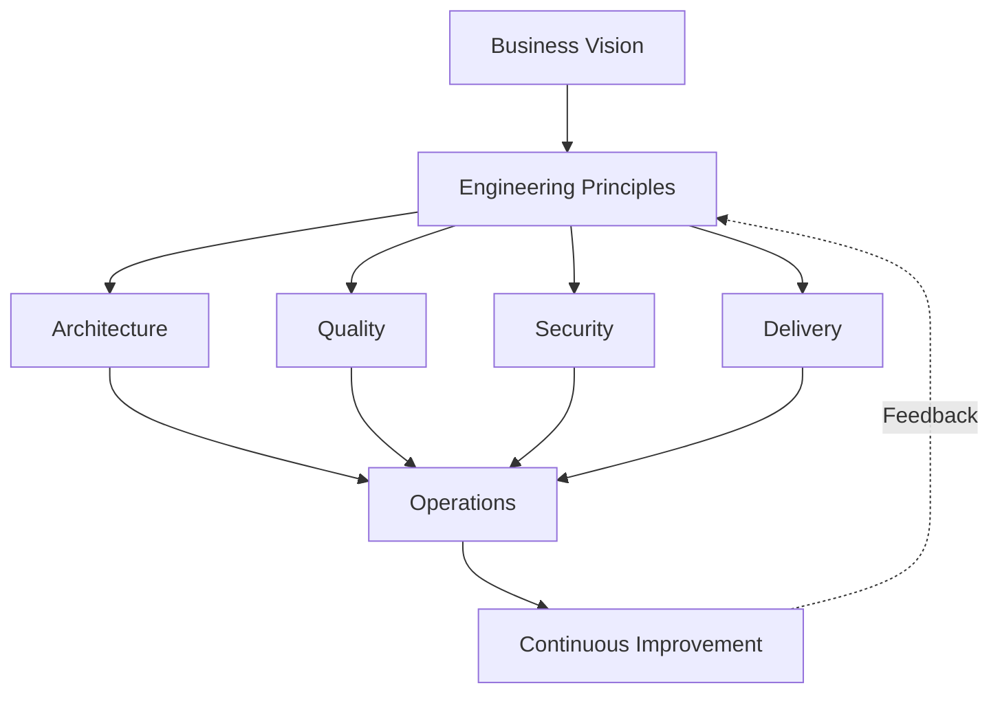

# Engineering Excellence

## Engineering Question

**What distinguishes engineering organizations that consistently deliver reliable software from those that struggle to do so?**

---

# Purpose

This chapter defines the Engineering Excellence model used throughout this playbook.

Rather than treating quality, architecture, testing, security or delivery as independent disciplines, Engineering Excellence views them as interconnected capabilities that together enable reliable software delivery.

Every subsequent chapter in this repository builds upon this model.

---

# What Engineering Excellence Is

Engineering Excellence is the continuous pursuit of building software that is:

- Reliable
- Secure
- Maintainable
- Observable
- Testable
- Performant
- Scalable
- Sustainable

Engineering Excellence is not achieved by adopting a specific framework, programming language or methodology.

It is achieved through disciplined engineering decisions applied consistently throughout the software lifecycle.

---

# What Engineering Excellence Is Not

Engineering Excellence is **not**:

- Writing perfect code.
- Achieving 100% test coverage.
- Using the latest technology.
- Automating everything.
- Eliminating every defect.
- Following a process without understanding its purpose.

Engineering Excellence is about making good engineering decisions that maximize long-term value while balancing cost, complexity and risk.

---

# The Engineering Excellence Model

Engineering Excellence consists of six interconnected pillars.

The Engineering Excellence model is a continuous system rather than a sequential process.

Business objectives establish engineering principles, which guide architectural, quality, security and delivery decisions. These capabilities enable successful operations, while operational feedback continuously improves the engineering system.

Engineering Excellence emerges from the interaction of these capabilities rather than from optimizing any individual discipline in isolation.

## 1. Architecture

Build systems that are understandable, maintainable and capable of evolving.

Architecture provides the foundation upon which every engineering decision is made.

---

## 2. Quality

Quality is engineered into the product from the beginning.

Testing validates quality; it does not create it.

---

## 3. Security

Security is considered throughout the software lifecycle rather than treated as a final validation activity.

Engineering teams continuously reduce risk through secure design, automation and verification.

---

## 4. Delivery

Reliable software requires reliable delivery.

Continuous Integration, Continuous Delivery and Quality Gates provide fast and trustworthy feedback.

---

## 5. Operations

Software continues to be engineered after deployment.

Observability, monitoring, incident response and operational feedback enable continuous improvement.

---

## 6. Continuous Improvement

Engineering organizations learn continuously.

Every incident, deployment, review and retrospective provides opportunities to improve both software and engineering practices.

---

# Common Misconceptions

## "Testing equals quality."

Testing measures confidence.

Quality is created through engineering.

---

## "Automation solves engineering problems."

Automation accelerates good processes.

It also accelerates poor ones.

---

## "Architecture is documentation."

Architecture is the set of decisions that shape a system.

Documentation records those decisions.

---

## "Security belongs only to security teams."

Every engineer contributes to software security.

---

## "Operations begin after deployment."

Operational thinking starts during system design.

---

# Engineering Principles

Engineering Excellence is guided by the following principles:

- Design for change.
- Prefer simplicity over unnecessary complexity.
- Automate repetitive work.
- Measure before optimizing.
- Prioritize according to risk.
- Document important decisions.
- Learn continuously.
- Build systems that people can understand.

---

# Self-Assessment

Consider the following questions:

- Can new engineers understand the system?
- Are engineering decisions documented?
- Does the delivery pipeline provide fast feedback?
- Is quality designed into development?
- Are security practices integrated into engineering workflows?
- Are systems observable in production?
- Does the team improve after incidents?

If the answer to several of these questions is **no**, engineering excellence should become an organizational objective rather than an individual one.

---

# Key Takeaways

- Engineering Excellence is a system, not a department.
- Quality, Architecture, Security, Delivery and Operations reinforce each other.
- Sustainable engineering requires balancing quality, speed and risk.
- Long-term engineering success comes from disciplined decision-making rather than individual heroics.

---

# Related Chapters

- Engineering Lifecycle
- Quality Engineering
- Risk-Based Engineering
- Shift Left
- Security
- Performance
- Delivery
- Architecture
- AI-Assisted Engineering

---

# Revision History

| Version | Date | Description |
|----------|------------|-----------------------------|
| 0.2 | 2026-07-19 | Initial chapter |
