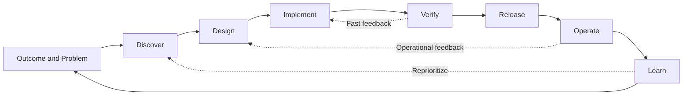

# Engineering Lifecycle

## Engineering Question

**How should software move from an idea to production while maintaining quality, security, delivery confidence and operational learning?**

---

# Purpose

This chapter defines the engineering lifecycle used throughout this playbook.

The lifecycle is not a sequence of isolated phases handed from one team to another. It is a continuous system in which discovery, design, implementation, verification, delivery and operations remain connected through fast feedback.

The objective is not simply to release software. The objective is to deliver useful change safely, learn from real outcomes and improve the system continuously.

---

# The Engineering Lifecycle Model

The lifecycle is circular rather than linear.

Each stage produces evidence for the next decision. Verification feeds implementation, production behavior informs design, and learning influences which problems should be solved next.

---

# Lifecycle Stages

## 1. Outcome and Problem

Start with the outcome to achieve and the problem to solve.

A team should understand:

- Who is affected.
- What problem exists.
- Why it matters now.
- What measurable outcome would represent improvement.
- What constraints and risks are already known.

A feature request is not automatically a problem definition.

---

## 2. Discover

Discovery reduces uncertainty before significant implementation effort is committed.

Typical activities include:

- Understanding user and business needs.
- Examining the current system and operational data.
- Identifying assumptions, dependencies and constraints.
- Evaluating security, compliance and delivery risks.
- Defining an initial success measure.

Discovery should be proportional to risk. A small reversible change does not require the same analysis as a critical architectural decision.

---

## 3. Design

Design converts the problem and constraints into an approach that can be implemented and validated.

Design includes more than architecture. It may cover:

- User experience.
- System boundaries and interfaces.
- Data ownership and movement.
- Failure behavior.
- Security controls.
- Testability and observability.
- Deployment and rollback strategy.

Important decisions should be documented, especially when they are expensive to reverse.

---

## 4. Implement

Implementation turns the design into a working change.

Good implementation practices include:

- Small, reviewable increments.
- Clear ownership.
- Automated checks close to the code.
- Secure coding practices.
- Meaningful peer review.
- Continuous integration.
- Updating documentation with the change.

Implementation is not complete when the code compiles. It is complete when the change is ready to be evaluated as part of the system.

---

## 5. Verify

Verification produces evidence that the change is suitable for release.

Verification may include:

- Automated tests.
- Exploratory testing.
- Integration and contract checks.
- Security analysis.
- Performance validation.
- Accessibility checks.
- Operational-readiness review.

The depth of verification should be driven by risk, not by habit.

Testing is one source of evidence. Reviews, telemetry, analysis and controlled experiments are also forms of verification.

---

## 6. Release

Release makes the change available safely and deliberately.

A reliable release process considers:

- Deployment automation.
- Environment consistency.
- Configuration management.
- Database and data compatibility.
- Feature controls.
- Rollback or recovery options.
- Release visibility and ownership.

Deployment and release are not always the same event. A change may be deployed before it is exposed to users.

---

## 7. Operate

Operation validates how the software behaves under real conditions.

Teams remain responsible for understanding:

- Availability and reliability.
- User-visible failures.
- Performance and capacity.
- Security events.
- Operational cost.
- Support demand.
- Whether the intended outcome was achieved.

Production is not the end of engineering. It is where many engineering assumptions are tested for the first time.

---

## 8. Learn

Learning closes the lifecycle.

Teams should compare intended outcomes with actual results and decide what to:

- Continue.
- Improve.
- Correct.
- Simplify.
- Remove.
- Investigate further.

Learning may come from telemetry, incidents, user feedback, delivery metrics, reviews and retrospectives.

The output of learning is a better next decision, not merely another report.

---

# Lifecycle Principles

## Work in Small Increments

Smaller changes reduce review complexity, shorten feedback loops and limit the impact of failure.

---

## Shift Feedback Left and Right

Move feedback earlier where defects and risks can be prevented, and continue feedback after release where real behavior can be observed.

---

## Make Risk Visible

Risk should influence design depth, testing effort, review expectations and release controls.

Treating every change identically wastes effort on low-risk work and under-protects critical work.

---

## Preserve Traceability

Teams should be able to connect:

- The problem.
- The decision.
- The implementation.
- The evidence.
- The release.
- The operational result.

Traceability should support decision-making, not become administrative overhead.

---

## Design for Operability

Logging, metrics, tracing, alerts, failure handling and recovery should be considered during design and implementation rather than added after release.

---

## Keep Ownership Continuous

Teams should not transfer responsibility at every lifecycle stage.

Specialists may contribute, but responsibility for the outcome should remain clear from discovery through operations.

---

# Practical Guidance

For each meaningful change, define:

1. **Problem** — What problem are we solving?
2. **Outcome** — What result do we expect?
3. **Risk** — What could fail or cause harm?
4. **Approach** — What solution are we choosing and why?
5. **Evidence** — What will give us confidence?
6. **Release strategy** — How will we introduce and recover the change safely?
7. **Operational signals** — What will show whether it works?
8. **Learning point** — When and how will we evaluate the result?

This lightweight structure can be applied to a user story, technical change, architectural initiative or production improvement.

---

# Common Mistakes

## Treating the Lifecycle as a Handoff Chain

Sequential handoffs create delayed feedback, unclear ownership and rework.

---

## Starting With a Solution

Teams often begin with a requested feature or technology before validating the problem and intended outcome.

---

## Deferring Quality and Security

Late verification finds problems when they are more expensive and disruptive to correct.

---

## Measuring Delivery Without Measuring Outcomes

A team may release frequently while producing little user or business value.

---

## Treating Production as Completion

Deployment without observation and learning leaves assumptions untested and improvement opportunities unused.

---

## Applying the Same Process to Every Change

Heavy governance slows low-risk work. Minimal governance exposes high-risk work. Controls should be proportional to risk.

---

# Lifecycle Checklist

Before implementation:

- [ ] The problem and expected outcome are clear.
- [ ] Important assumptions and risks are visible.
- [ ] The proposed approach is proportionate to the problem.
- [ ] Testability, security and operability were considered.

Before release:

- [ ] Relevant verification evidence is available.
- [ ] Deployment and recovery are understood.
- [ ] Ownership is clear.
- [ ] Operational signals are defined.

After release:

- [ ] The change is being observed.
- [ ] Actual results are compared with the intended outcome.
- [ ] Incidents and unexpected behavior produce follow-up actions.
- [ ] Learning influences future decisions.

---

# Key Takeaways

- The engineering lifecycle is continuous, not linear.
- Every stage should reduce uncertainty or produce useful evidence.
- Quality, security and operability belong throughout the lifecycle.
- Production provides feedback, not finality.
- Risk should determine the depth of engineering controls.
- The lifecycle is complete only when learning informs the next decision.

---

# Related Chapters

- [Engineering Excellence](10-ENGINEERING-EXCELLENCE.md)
- Quality Engineering
- Risk-Based Engineering
- Shift Left
- Security
- Delivery
- Architecture

---

# Revision History

| Version | Date | Description |
|---------|------------|---------------------------------------|
| 0.2 | 2026-07-19 | Initial engineering lifecycle chapter |
