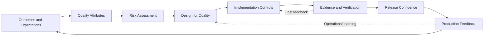

# Quality Engineering

## Engineering Question

**How is quality engineered into software from the first idea to production?**

---

# Purpose

This chapter defines how quality should be built into software delivery rather than inspected at the end.

Quality Engineering connects product intent, architecture, implementation, verification, delivery and operations through explicit quality decisions, fast feedback and evidence.

Testing is an important part of this system, but testing alone does not create quality.

---

# The Quality Engineering Model

Quality Engineering is a continuous system.

Desired outcomes define the relevant quality attributes. Risk determines where deeper controls are justified. Design and implementation create quality, while verification produces evidence about whether the system behaves as intended. Production feedback then improves future decisions.

---

# What Quality Means

Quality is the degree to which a system satisfies the needs and expectations that matter in its context.

Those expectations include more than functional correctness. Depending on the system, quality may include:

- Reliability.
- Security.
- Performance.
- Accessibility.
- Usability.
- Maintainability.
- Compatibility.
- Observability.
- Recoverability.
- Data integrity.

A system can be functionally correct and still be low quality if it is unsafe, slow, difficult to operate or expensive to change.

---

# Quality Is Contextual

There is no universal quality standard for every system.

The required level of assurance depends on factors such as:

- Business criticality.
- User impact.
- Regulatory obligations.
- Security exposure.
- Change frequency.
- Failure cost.
- Reversibility.
- Architectural complexity.

A low-risk internal tool and a safety-critical system should not use identical controls.

Quality Engineering should be proportionate to risk and consequence.

---

# Quality Responsibilities Across the Lifecycle

## 1. Outcomes and Expectations

Define what success means before selecting tests or tools.

Teams should understand:

- Who depends on the system.
- What outcomes matter.
- Which failures are unacceptable.
- Which quality attributes are most important.
- How success will be observed.

Without explicit expectations, quality becomes subjective.

---

## 2. Quality Attributes

Translate broad expectations into concrete system characteristics.

Examples include:

- Availability targets.
- Response-time expectations.
- Security boundaries.
- Recovery objectives.
- Accessibility requirements.
- Maintainability constraints.

Quality attributes should be specific enough to influence architecture, implementation and verification.

---

## 3. Risk Assessment

Identify what could fail, why it matters and where evidence is needed.

Risk assessment should consider:

- Probability of failure.
- Business and user impact.
- Detectability.
- Reversibility.
- Exposure duration.
- Dependency complexity.

The purpose is not to eliminate all risk. It is to make informed decisions about where engineering effort provides the greatest value.

---

## 4. Design for Quality

Quality begins in design.

Important considerations include:

- Clear system boundaries.
- Failure isolation.
- Testable interfaces.
- Secure defaults.
- Observability.
- Data consistency.
- Recovery mechanisms.
- Deployment safety.

Poor design cannot be compensated for by adding more tests later.

---

## 5. Implementation Controls

Implementation should preserve the intended quality characteristics.

Useful controls include:

- Small, reviewable changes.
- Clear coding standards.
- Automated static checks.
- Peer review.
- Secure coding practices.
- Contract validation.
- Dependency controls.
- Documentation updates.

Controls should provide fast feedback close to the point where defects are introduced.

---

## 6. Evidence and Verification

Verification produces evidence that the system satisfies relevant expectations.

Evidence may come from:

- Automated tests.
- Exploratory testing.
- Reviews.
- Static analysis.
- Security analysis.
- Performance experiments.
- Accessibility evaluation.
- Production telemetry.
- Controlled releases.

No single type of evidence is sufficient for every risk.

---

## 7. Release Confidence

Release decisions should be based on evidence, not optimism.

A team should understand:

- What changed.
- What risks remain.
- What evidence is available.
- Which assumptions are unverified.
- How the change will be introduced.
- How failure will be detected and recovered.

Quality gates should support decisions rather than become ceremonial approvals.

---

## 8. Production Feedback

Production provides evidence that cannot be fully reproduced before release.

Teams should observe:

- User outcomes.
- Reliability.
- Error behavior.
- Performance.
- Security signals.
- Operational cost.
- Support demand.
- Unexpected usage patterns.

Quality Engineering continues after deployment.

---

# Quality Engineering Principles

## Quality Is a Shared Responsibility

Quality is not owned by a test team.

Product, architecture, engineering, security, operations and testing all contribute different forms of expertise and evidence.

---

## Prevention Is More Valuable Than Detection

Preventing a defect through a clear requirement, sound design or safe interface is generally more effective than detecting it late.

Detection remains necessary because prevention is never perfect.

---

## Risk Determines Depth

The depth of review, testing and release controls should reflect the risk of the change.

Equal treatment of unequal risks is inefficient and unsafe.

---

## Fast Feedback Improves Quality

The earlier useful feedback arrives, the cheaper and easier it is to act on.

Feedback should exist during discovery, design, implementation, integration, release and operations.

---

## Evidence Over Assumptions

Confidence should be supported by observable evidence.

Evidence should be relevant to the risk and strong enough to support the decision being made.

---

## Quality Must Remain Sustainable

A quality strategy that is too expensive, slow or difficult to maintain will eventually be bypassed.

Controls should be effective, proportionate and maintainable.

---

# Testing Within Quality Engineering

Testing is a method for learning about software behavior.

It can:

- Reveal defects.
- Validate assumptions.
- Explore unknown behavior.
- Measure system characteristics.
- Produce release evidence.

Testing cannot independently guarantee quality because many quality problems originate in unclear outcomes, poor architecture, weak ownership or unsafe delivery practices.

The right question is not:

> How much testing do we have?

It is:

> Do we have sufficient evidence for the risks we are accepting?

---

# Practical Guidance

For each meaningful change, define:

1. **Outcome** — What user or business result matters?
2. **Quality attributes** — Which system characteristics are important?
3. **Risks** — What could fail and what would the impact be?
4. **Prevention** — Which design and implementation decisions reduce risk?
5. **Evidence** — What will demonstrate acceptable behavior?
6. **Release controls** — How will exposure and recovery be managed?
7. **Operational signals** — What will reveal success or failure in production?
8. **Learning** — How will evidence improve future decisions?

This structure can be applied at product, system, feature or change level.

---

# Common Mistakes

## Treating Quality as Testing

This ignores the decisions that create reliability, security, maintainability and operability before testing begins.

---

## Chasing Coverage Without Understanding Risk

Coverage can show what was executed, but not whether the most important risks were addressed.

---

## Automating Every Check

Automation is valuable for repeatable feedback, but exploratory, contextual and human evaluation remain necessary.

---

## Deferring Non-Functional Quality

Performance, security, accessibility and operability are often discovered too late because they were not considered during design.

---

## Using Quality Gates Without Decision Criteria

A gate that always passes, is routinely overridden or measures irrelevant data creates delay without confidence.

---

## Separating Quality Ownership

When one team is responsible for building and another is expected to guarantee quality, handoffs and defensive behavior replace shared accountability.

---

## Ignoring Production Evidence

Pre-release verification cannot reproduce every real workload, dependency or user behavior.

Ignoring operational feedback leaves important assumptions untested.

---

# Quality Engineering Checklist

Before implementation:

- [ ] The intended outcome is clear.
- [ ] Relevant quality attributes are explicit.
- [ ] Important risks and failure modes are visible.
- [ ] The design supports testability, security and operability.
- [ ] Acceptance and evidence expectations are understood.

During implementation:

- [ ] Changes remain small and reviewable.
- [ ] Appropriate automated checks provide fast feedback.
- [ ] Peer review considers more than code style.
- [ ] Interfaces and dependencies are validated.
- [ ] Documentation changes with the system.

Before release:

- [ ] Evidence addresses the important risks.
- [ ] Known limitations and residual risks are visible.
- [ ] Deployment, exposure and recovery are understood.
- [ ] Operational signals and ownership are defined.

After release:

- [ ] Real behavior is being observed.
- [ ] Outcomes are compared with expectations.
- [ ] Incidents and defects produce systemic improvements.
- [ ] Quality evidence influences future priorities.

---

# Key Takeaways

- Quality is created across the engineering lifecycle, not added by testing.
- Quality is contextual and should be driven by outcomes, attributes and risk.
- Prevention, fast feedback and relevant evidence are central to Quality Engineering.
- Testing is one source of evidence within a broader engineering system.
- Release confidence should be based on explicit evidence and understood residual risk.
- Production feedback is part of quality, not separate from it.

---

# Related Chapters

- [Engineering Excellence](10-ENGINEERING-EXCELLENCE.md)
- [Engineering Lifecycle](11-ENGINEERING-LIFECYCLE.md)
- Risk-Based Engineering
- Shift Left
- Security
- Performance
- Delivery
- Architecture

---

# Revision History

| Version | Date | Description |
|---------|------------|-------------------------------------|
| 0.3 | 2026-07-23 | Initial Quality Engineering chapter |
